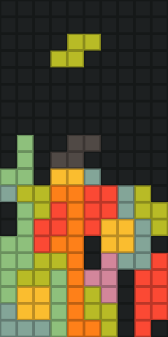

# Tiny games

A collection of tiny games. I have tried to keep the source (without comments) small enough to fit a qr code

# Games

## Vier


Fill up lines using tetronimoes, don't let the screen fill up.

## Snek


Collect red dots and grow larger, dont bump into walls or yourself


# Instructions

To build all games:
```bash
make
```

To build the binaries you need to have the sdl2 development files
installed, on debian based system this can be done as follows:

```bash
sudo apt install libsdl2-dev
```


